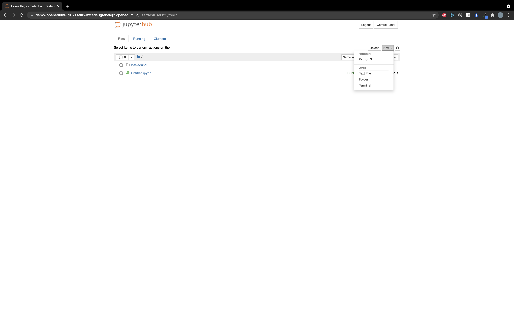
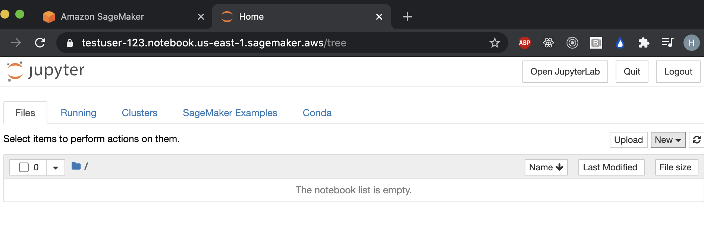
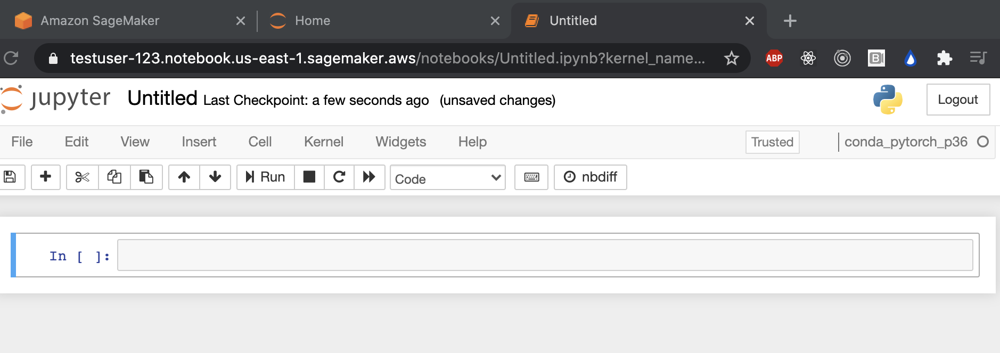

# OpenEduML

## Introduction

OpenEduML is an online PaaS designed to provide students of all levels access to an easy to use
online environment where they can launch machine learning workloads. OpenEduML uses Jupyter
open-source software to provide users with an online notebook environment in which they can launch
different types of machine-learning kernels (Python w/ Tensorflow, R, etc.). The mission of
OpenEduML is to give aspiring data scientists an online location to store and access their work;
along with removing the overhead of installing and managing all the software for developing machine
learning models. OpenEduML represents great value to users who are looking for a simplified
experience (particularly students who will be running workloads in excess of 30 hours per month).
OpenEduML is comparatively 25-30% cheaper on an per-hourly basis compared to AWS Sagemaker, which
the latter does contain extra features.

<!--  -->

<h4 align="center">OpenEduML Jupyterhub Notebook</h4>
<p align="center">
  
</p>

<h4 align="center">AWS SageMaker Jupyterhub Notebook</h4>
<p align="center">
  
</p>

<h4 align="center">OpenEduML Python3 w/ TensorFlow Kernel</h4>
<p align="center">
  
</p>

<h4 align="center">SageMaker Python3 kernel</h4>
<p align="center">
  
</p>

```

```
